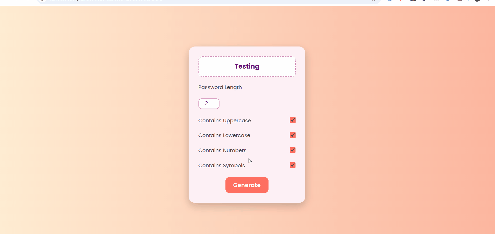

# 🔐 Random Password Generator

A simple yet powerful **Random Password Generator** built using **HTML, CSS, and JavaScript**.  
Easily generate secure passwords with customizable options for length, uppercase, lowercase, numbers, and symbols.

---

## 📌 Features

- ✨ **Custom Length** – Choose password length (2 to 30 characters)
- 🔠 **Uppercase & Lowercase** – Include/exclude letters as per your need
- 🔢 **Numbers** – Option to add digits
- 🔣 **Symbols** – Add special characters for stronger passwords
- 🎨 **Modern & Responsive UI** – Stylish design with smooth hover effects
- ⚡ **Instant Generation** – Just one click to generate

---

## 🛠️ Technologies Used

- **HTML5**
- **CSS3**
- **JavaScript (Vanilla JS)**

---

## 🎥 Demo

---

## 📷 Preview

The generator allows you to quickly create secure and random passwords with different character sets:

- Uppercase Letters (A–Z)
- Lowercase Letters (a–z)
- Numbers (0–9)
- Symbols (~!@#$%^&*()_+/)

---

## 🧑‍💻 Developer

Developed by Asim Mir  
[GitHub: asim249](https://github.com/asim249)
